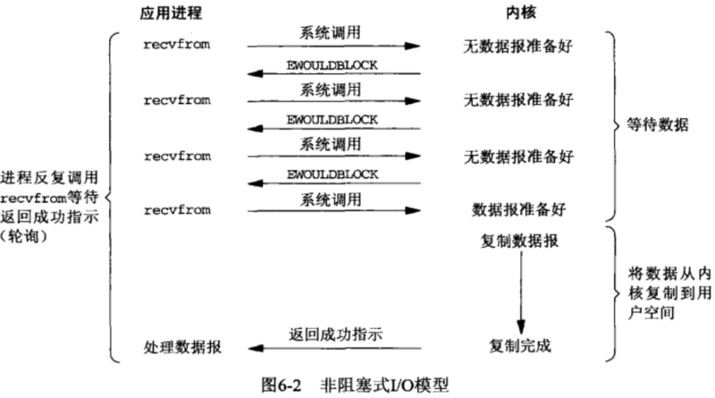
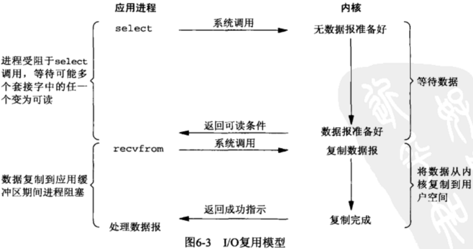
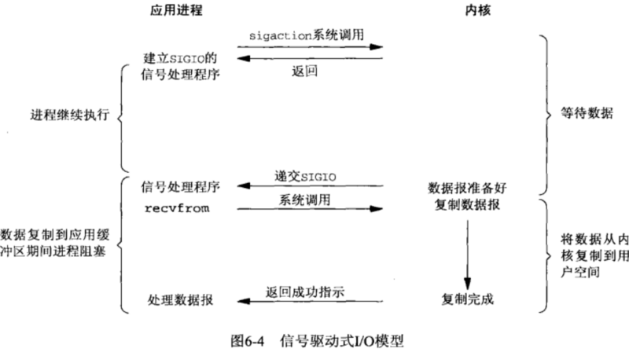
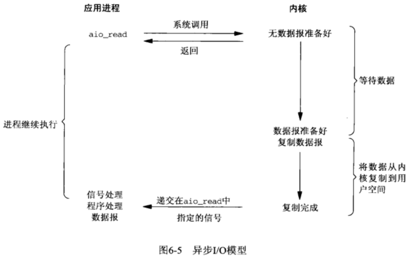
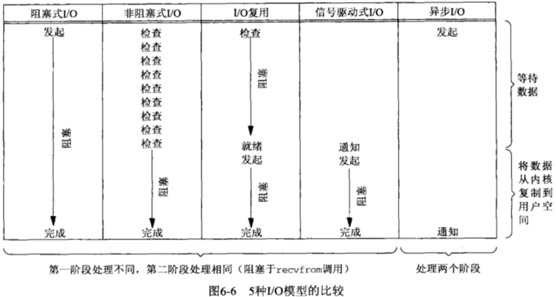

服务端编程常需要接触I/O。最近对I/O模型有了进一步的认识，这里就总结一下POSIX I/O模型，并简略总结一下Java中的Network I/O模型。常见的POSIX I/O模型有四种：

* 同步阻塞I/O（Synchrohous, blocking I/O）
* 同步非阻塞I/O（Synchrohous, non-blocking I/O）
* I/O多路复用（I/O Multiplexing），较为典型的有select和epoll模型
* 异步I/O（Asynchronous I/O）

### 通俗解释
在详细解释各个I/O模型之前，我们先来通俗地解释一下各个I/O模型，便于理解。

* 同步阻塞I/O：去餐厅吃饭，等餐的时候需要在取餐处一直等着，不能干其他事情。
* 同步非阻塞I/O：去餐厅吃饭，等餐的时候可以干别的事，但需要不断去窗口询问饭是否准备好了（轮询）。
* 异步I/O：去餐厅吃饭，等餐的时候只需要坐着等人送来即可。

下面我们来详细解释一下各个I/O模型，为了简单起见这里采用UDP协议作为示例。
### Blocking I/O
首先对于一个从socket读取数据的操作，通常将其分为两个阶段：

1. 等待远程数据就绪。网卡会将数据报文传给协议栈，封装处理之后拷贝到内核缓冲区中

2. 将数据从内核缓冲区拷贝到进程中

最简单的模型就是blocking I/O模型了。进行recvfrom系统调用（读取数据）以后，调用者进程会被阻塞，直到内核接收到数据并拷贝到进程中才返回。进行recvfrom系统调用后，内核首先会等待数据就绪，这通常需要一段时间。当数据就绪并到达内核缓冲区后，内核就会将数据拷贝至用户内存空间，并且返回结果，此时调用者进程才会解除阻塞状态，恢复执行。Blocking I/O不会浪费CPU时间片，但是只能处理一个连接，对于多个连接的情况就需要用到下面要提到的的I/O多路复用了。

可以看出，blocking I/O会阻塞上面两个阶段：

### Non-blocking I/O
与blocking I/O不同，non-blocking I/O的意思是在读取数据(recvfrom)时，如果数据没有就绪则立刻返回一个错误，而不会被阻塞住，这样我们还可以继续进行其它的操作。为了读取到数据，我们需要不断调用recvfrom进行轮询操作，一旦数据准备好了，内核就会将数据拷贝至用户内存空间，并且返回读取成功的结果。这种模型的弊端就是轮询操作会占用时间片，浪费CPU资源。可以看出，non-blocking I/O会阻塞上面的阶段(2)：

### I/O multiplexing
I/O多路复用(multiplexing)是网络编程中最常用的模型，像我们最常用的select、epoll都属于这种模型。以select为例：

看起来它与blocking I/O很相似，两个阶段都阻塞。但它与blocking I/O的一个重要区别就是它可以等待多个文件描述符就绪，即可以处理多个连接。这里的select相当于一个“代理”，调用select以后进程会被select阻塞，这时候在内核空间内select会监听指定的的多个文件描述符(如socket连接)，如果其中任意一个数据就绪了就返回。此时程序再进行数据读取操作，将数据拷贝至当前进程内。由于select可以监听多个socket，我们可以用它来处理多个连接。

在select模型中每个socket一般都设置成non-blocking，虽然阶段(1)仍然是阻塞状态，但是它是被select调用阻塞的，而不是直接被I/O阻塞的。select底层通过轮询机制来判断每个socket读写是否就绪。

当然select也有一些缺点，比如底层轮询机制会增加开销、支持的文件描述符数量过少等。为此，Linux引入了epoll作为select的改进版本。
### Signal Driven I/O
在信号驱动式I/O模型中，与阻塞式和非阻塞式有了一个本质的区别，那就是用户态进程不再等待内核态的数据准备好，直接可以去做别的事情。

### Asynchronous I/O
Asynchronous I/O的过程：

这里面的读取操作的语义与上面的几种模型都不同。这里的读取操作(aio_read)会通知内核进行读取操作并将数据拷贝至进程中，完事后通知进程整个操作全部完成（绑定一个回调函数处理数据）。读取操作会立刻返回，程序可以进行其它的操作，所有的读取、拷贝工作都由内核去做，做完以后通知进程，进程调用绑定的回调函数来处理数据。

异步I/O在网络编程中几乎用不到，在File I/O中可能会用到。
### Java中的Network I/O模型
Java原生的Network I/O模型分为以下几种：

* BIO(如ServerSocket)
* NIO(JDK 1.4引入，如ServerSocketChannel)
* NIO.2(AIO, JDK 1.7引入，如AsynchronousServerSocketChannel)

其中BIO对应传统的同步阻塞I/O，而NIO对应I/O多路复用(select模型，Reactor模式)，NIO.2则对应异步IO模型（依然是基于I/O多路复用，和POSIX的asynchronous I/O模型不同）。在Linux下，NIO和NIO.2底层都是通过epoll实现的。

Netty的I/O模型也类似，分为OIO和NIO两种。
### 总结
我们来总结一下阻塞、非阻塞，同步和异步这两组概念。

先来说阻塞和非阻塞。阻塞调用会一直等待远程数据就绪再返回，即上面的阶段(1)会阻塞调用者，直到读取结束。而非阻塞无论在什么情况下都会立即返回。

接下来是同步和异步。POSIX标准里是这样定义同步和异步的：
> A synchronous I/O operation causes the requesting process to be blocked until that I/O operation completes.
> 
> An asynchronous I/O operation does not cause the requesting process to be blocked.

同步方法会一直阻塞进程，直到I/O操作结束，注意这里相当于上面的(1)(2)两个阶段都会阻塞调用者。而异步方法不会阻塞调用者进程，即使是从内核空间的缓冲区将数据拷贝到进程中这一操作也不会阻塞进程，拷贝完毕后内核会通知进程数据拷贝结束。

下面的这张图很好地总结了之前讲的这几种POSIX I/O模型（来自Unix Network Programming）：

