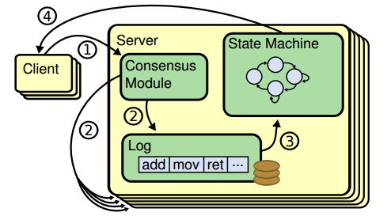
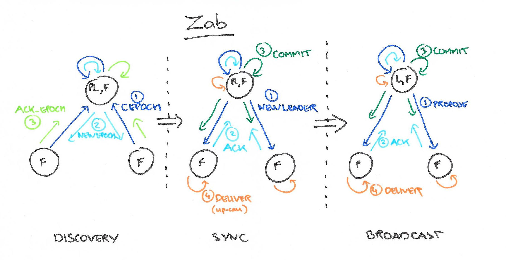
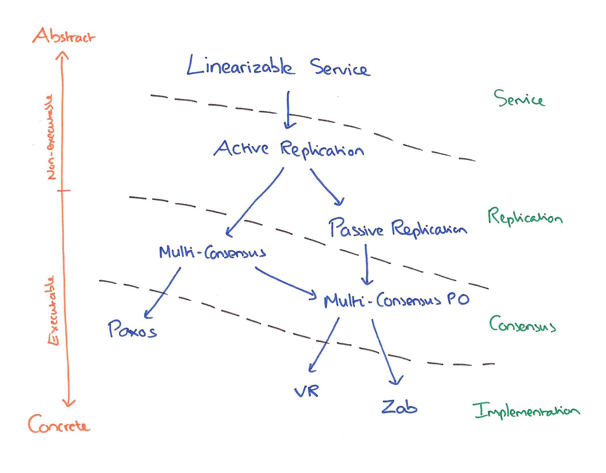

### Raft
Paxos偏向于理论、对如何应用到工程实践提及较少。理解的难度加上现实的骨感，在生产环境中基于Paxos实现一个正确的分布式系统非常难：

> There are significant gaps between the description of the Paxos algorithm and the needs of a real-world system. In order to build a real-world system, an expert needs to use numerous ideas scattered in the literature and make several relatively small protocol extensions. The cumulative effort will be substantial and the final system will be based on an unproven protocol.

Raft在2013年提出，提出的时间虽然不长，但已经有很多系统基于Raft实现。相比Paxos，Raft的买点就是更利于理解、更易于实行。

为达到更容易理解和实行的目的，Raft将问题分解和具体化：Leader统一处理变更操作请求，一致性协议的作用具化为保证节点间操作日志副本(log replication)一致，以term作为逻辑时钟(logical clock)保证时序，节点运行相同状态机(state machine)得到一致结果。Raft协议具体过程如下：

1. Client发起请求，每一条请求包含操作指令

2. 请求交由Leader处理，Leader将操作指令(entry)追加(append)至操作日志，紧接着对Follower发起AppendEntries请求、尝试让操作日志副本在Follower落地

3. 如果Follower多数派(quorum)同意AppendEntries请求，Leader进行commit操作、把指令交由状态机处理

4. 状态机处理完成后将结果返回给Client

指令通过log index(指令id)和term number保证时序，正常情况下Leader、Follower状态机按相同顺序执行指令，得出相同结果、状态一致。

宕机、网络分化等情况可引起Leader重新选举(每次选举产生新Leader的同时，产生新的term)、Leader/Follower间状态不一致。Raft中Leader为自己和所有Follower各维护一个nextIndex值，其表示Leader紧接下来要处理的指令id以及将要发给Follower的指令id，L_nextIndex不等于F_nextIndex时代表Leader操作日志和Follower操作日志存在不一致，这时将从Follower操作日志中最初不一致的地方开始，由Leader操作日志覆盖Follower，直到L_nextIndex、F_nextIndex相等。 

Paxos中Leader的存在是为了提升决议效率，Leader的有无和数目并不影响决议一致性，Raft要求具备唯一Leader，并把一致性问题具体化为保持日志副本的一致性，以此实现相较Paxos而言更容易理解、更容易实现的目标。
### Zab
Zab的全称是Zookeeper atomic broadcast protocol，是Zookeeper内部用到的一致性协议。相比Paxos，Zab最大的特点是保证强一致性(strong consistency，或叫线性一致性linearizable consistency)。

和Raft一样，Zab要求唯一Leader参与决议，Zab可以分解成discovery、sync、broadcast三个阶段：

* **discovery**: 选举产生PL(prospective leader)，PL收集Follower epoch(cepoch)，根据Follower的反馈PL产生newepoch(每次选举产生新Leader的同时产生新epoch，类似Raft的term)
* **sync**: PL补齐相比Follower多数派缺失的状态、之后各Follower再补齐相比PL缺失的状态，PL和Follower完成状态同步后PL变为正式Leader(established leader)
* **broadcast**: Leader处理Client的写操作，并将状态变更广播至Follower，Follower多数派通过之后Leader发起将状态变更落地(deliver/commit)

Leader和Follower之间通过心跳判别健康状态，正常情况下Zab处在broadcast阶段，出现Leader宕机、网络隔离等异常情况时Zab重新回到discovery阶段。

了解完Zab的基本原理，我们再来看Zab怎样保证强一致性，Zab通过约束事务先后顺序达到强一致性，先广播的事务先commit、FIFO，Zab称之为primary order(以下简称PO)。实现PO的核心是zxid。

Zab中每个事务对应一个zxid，它由两部分组成：<e, c>，e即Leader选举时生成的epoch，c表示当次epoch内事务的编号、依次递增。假设有两个事务的zxid分别是z、z'，当满足 z.e < z'.e 或者 z.e = z'.e && z.c < z'.c 时，定义z先于z'发生(z < z')。

为实现PO，Zab对Follower、Leader有以下约束：

1. 有事务z和z'，如果Leader先广播z，则Follower需保证先commit z对应的事务

2. 有事务z和z'，z由Leader p广播，z'由Leader q广播，Leader p先于Leader q，则Follower需保证先commit z对应的事务

3. 有事务z和z'，z由Leader p广播，z'由Leader q广播，Leader p先于Leader q，如果Follower已经commit z，则q需保证已commit z才能广播z'

第1、2点保证事务FIFO，第3点保证Leader上具备所有已commit的事务。

相比Paxos，Zab约束了事务顺序、适用于有强一致性需求的场景。
### Paxos、Raft、Zab再比较
除Paxos、Raft和Zab外，Viewstamped Replication(简称VR)也是讨论比较多的一致性协议。这些协议包含很多共同的内容(Leader、quorum、state machine等)，因而我们不禁要问：Paxos、Raft、Zab和VR等分布式一致性协议区别到底在哪，还是根本就是一回事？

Paxos、Raft、Zab和VR都是解决一致性问题的协议，Paxos协议原文倾向于理论，Raft、Zab、VR倾向于实践，一致性保证程度等的不同也导致这些协议间存在差异。下图帮助我们理解这些协议的相似点和区别：

相比Raft、Zab、VR，Paxos更纯粹、更接近一致性问题本源，尽管Paxos倾向理论，但不代表Paxos不能应用于工程。基于Paxos的工程实践，须考虑具体需求场景(如一致性要达到什么程度)，再在Paxos原始语意上进行包装。 
### 小结
以上介绍分布式一致性协议Raft、Zab的核心思想，分析Raft、Zab与Paxos的异同。实现分布式系统时，先从具体需求和场景考虑，Raft、Zab、VR、Paxos等协议没有绝对地好与不好，只是适不适合。
