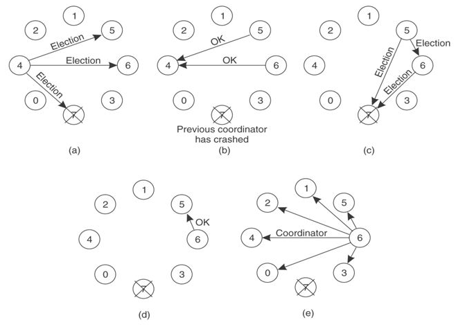
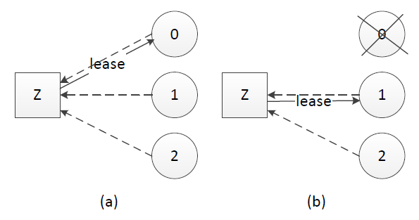

选举(election)是分布式系统实践中常见的问题，通过打破节点间的对等关系，选得的leader(或叫master、coordinator)有助于实现事务原子性、提升决议效率。 多数派(quorum)的思路帮助我们在网络分化的情况下达成决议一致性，在leader选举的场景下帮助我们选出唯一leader。租约(lease)在一定期限内给予节点特定权利，也可以用于实现leader选举。

下面我们就来学习分布式系统理论中的选举、多数派和租约。
### 选举(electioin)
一致性问题(consistency)是独立的节点间如何达成决议的问题，选出大家都认可的leader本质上也是一致性问题，因而如何应对宕机恢复、网络分化等在leader选举中也需要考量。

Bully算法是最常见的选举算法，其要求每个节点对应一个序号，序号最高的节点为leader。leader宕机后次高序号的节点被重选为leader，过程如下：

(a). 节点4发现leader不可达，向序号比自己高的节点发起重新选举，重新选举消息中带上自己的序号

(b)(c). 节点5、6接收到重选信息后进行序号比较，发现自身的序号更大，向节点4返回OK消息并各自向更高序号节点发起重新选举

(d). 节点5收到节点6的OK消息，而节点6经过超时时间后收不到更高序号节点的OK消息，则认为自己是leader

(e). 节点6把自己成为leader的信息广播到所有节点

可以看到，Bully算法中有2PC的身影，都具有提议(propose)和收集反馈(vote)的过程。

在一致性算法Paxos、ZAB、Raft中，为提升决议效率均有节点充当leader的角色。ZAB、Raft中描述了具体的leader选举实现，与Bully算法类似ZAB中使用zxid标识节点，具有最大zxid的节点表示其所具备的事务(transaction)最新、被选为leader。
### 多数派(quorum)
在网络分化的场景下以上Bully算法会遇到一个问题，被分隔的节点都认为自己具有最大的序号、将产生多个leader，这时候就需要引入多数派(quorum)。多数派的思路在分布式系统中很常见，其确保网络分化情况下决议唯一。

多数派的原理说起来很简单，假如节点总数为2f+1，则一项决议得到多于 f 节点赞成则获得通过。leader选举中，网络分化场景下只有具备多数派节点的部分才可能选出leader，这避免了多leader的产生。

多数派的思路还被应用于副本(replica)管理，根据业务实际读写比例调整写副本数Vw、读副本数Vr，用以在可靠性和性能方面取得平衡。
### 租约(lease)
选举中很重要的一个问题，以上尚未提到：怎么判断leader不可用、什么时候应该发起重新选举？最先可能想到会通过心跳(heart beat)判别leader状态是否正常，但在网络拥塞或瞬断的情况下，这容易导致出现双主。

租约(lease)是解决该问题的常用方法，其最初提出时用于解决分布式缓存一致性问题，后面在分布式锁等很多方面都有应用。

租约的原理同样不复杂，中心思想是每次租约时长内只有一个节点获得租约、到期后必须重新颁发租约。假设我们有租约颁发节点Z，节点0、1和2竞选leader，租约过程如下：

(a). 节点0、1、2在Z上注册自己，Z根据一定的规则(例如先到先得)颁发租约给节点，该租约同时对应一个有效时长；这里假设节点0获得租约、成为leader

(b). leader宕机时，只有租约到期(timeout)后才重新发起选举，这里节点1获得租约、成为leader

租约机制确保了一个时刻最多只有一个leader，避免只使用心跳机制产生双主的问题。在实践应用中，zookeeper、ectd可用于租约颁发。
### 小结
在分布式系统理论和实践中，常见leader、quorum和lease的身影。分布式系统内不一定事事协商、事事民主，leader的存在有助于提升决议效率。

本文以leader选举作为例子引入和讲述quorum、lease，当然quorum和lease是两种思想，并不限于leader选举应用。
