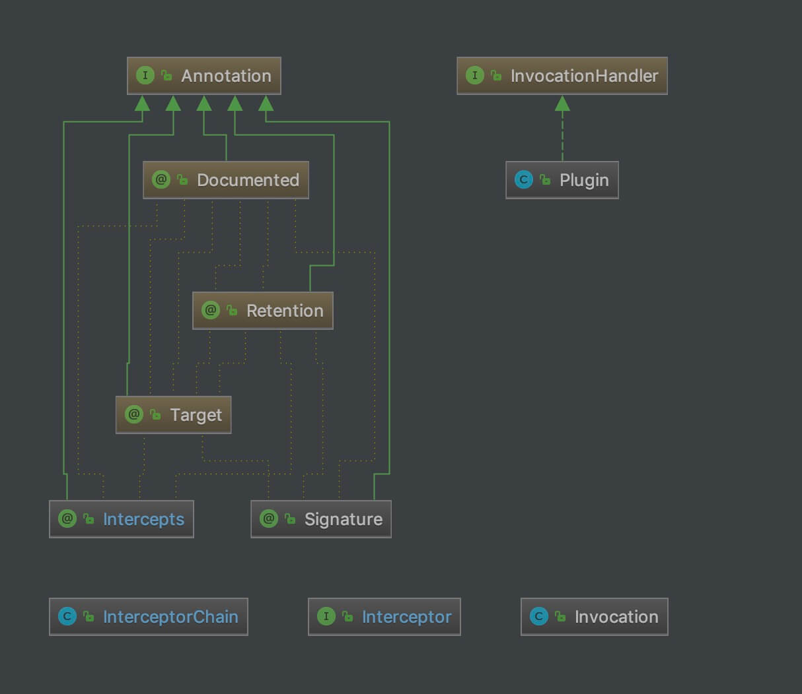

## 1. 概述

本文，我们来分享 MyBatis 的插件模块，对应 `plugin` 包。如下图所示：


在 [《精尽 MyBatis 源码解析 —— 项目结构一览》](http://svip.iocoder.cn/MyBatis/intro) 中，简单介绍了这个模块如下：

> Mybatis 自身的功能虽然强大，但是并不能完美切合所有的应用场景，因此 MyBatis 提供了插件接口，我们可以通过添加用户自定义插件的方式对 MyBatis 进行扩展。用户自定义插件也可以改变 Mybatis 的默认行为，例如，我们可以拦截 SQL 语句并对其进行重写。
>
> 由于用户自定义插件会影响 MyBatis 的核心行为，在使用自定义插件之前，开发人员需要了解 MyBatis 内部的原理，这样才能编写出安全、高效的插件。

总的来说，MyBatis 的插件，还是基于**动态代理**来实现。

另外，胖友先看看 [《MyBatis 官方文档 —— 插件》](http://www.mybatis.org/mybatis-3/zh/configuration.html#plugins) 文档，对 MyBatis 插件的概念和配置，再有一个了解。

本文涉及的类如下图所示：



## 2. Interceptor

`org.apache.ibatis.plugin.Interceptor` ，拦截器接口。代码如下：

```java
// Interceptor.java

public interface Interceptor {

    /**
     * 拦截方法
     *
     * @param invocation 调用信息
     * @return 调用结果
     * @throws Throwable 若发生异常
     */
    Object intercept(Invocation invocation) throws Throwable;

    /**
     * 应用插件。如应用成功，则会创建目标对象的代理对象
     *
     * @param target 目标对象
     * @return 应用的结果对象，可以是代理对象，也可以是 target 对象，也可以是任意对象。具体的，看代码实现
     */
    Object plugin(Object target);

    /**
     * 设置拦截器属性
     *
     * @param properties 属性
     */
    void setProperties(Properties properties);

}
```

### 2.1 示例

我们来看看 `org.apache.ibatis.plugin.PluginTest` ，提供了 AlwaysMapPlugin 示例。代码如下：

```java
@Intercepts({
        @Signature(type = Map.class, method = "get", args = {Object.class})}) // <1>
public static class AlwaysMapPlugin implements Interceptor {

    @Override // <4>
    public Object intercept(Invocation invocation) throws Throwable {
        return "Always";
    }

    @Override // <2>
    public Object plugin(Object target) {
        return Plugin.wrap(target, this);
    }

    @Override // <3>
    public void setProperties(Properties properties) {
    }

}
```

`<1>` 处，通过 `@Intercepts` 和 `@Signature` 注解，定义了需要拦截的方法为 Map 类型、方法为 `"get"` 方法，方法参数为 `Object.class` 。

`<2>` 处，在实现方法 `#plugin(Object target)` 方法内部，他调用 `Plugin#wrap(Object target, Interceptor interceptor)` 方法，执行代理对象的创建。

`<3>` 处，在实现方法 `#setProperties(Properties properties)` 方法内部，暂未做任何实现。此处可以实现，若 AlwaysMapPlugin 有属性，可以从 `properties` 获取一些需要的属性值。

`<4>` 处，在实现方法 `#intercept(Invocation invocation)` 方法，直接返回 `"Always"` 字符串。也就是说，当所有的 `target` 类型为 Map 类型，并且调用 `Map#get(Object)` 方法时，返回的都是 `"Always"` 。

这个示例，胖友可以跑下 PluginTest 单元测试里的方法，可以更加好理解。

### 2.2 Invocation

`org.apache.ibatis.plugin.Invocation` ，方法调用信息，作为 `Interceptor#intercept(Invocation invocation)` 的方法参数。代码如下：

```java
// Invocation.java

public interface Interceptor {

    /**
     * 拦截方法
     *
     * @param invocation 调用信息
     * @return 调用结果
     * @throws Throwable 若发生异常
     */
    Object intercept(Invocation invocation) throws Throwable;

    /**
     * 应用插件。如应用成功，则会创建目标对象的代理对象
     *
     * @param target 目标对象
     * @return 应用的结果对象，可以是代理对象，也可以是 target 对象，也可以是任意对象。具体的，看代码实现
     */
    Object plugin(Object target);

    /**
     * 设置拦截器属性
     *
     * @param properties 属性
     */
    void setProperties(Properties properties);

}
```

## 3. InterceptorChain

`org.apache.ibatis.plugin.InterceptorChain` ，拦截器 Interceptor 链。

### 3.1 构造方法

```java
// InterceptorChain.java

/**
 * 拦截器数组
 */
private final List<Interceptor> interceptors = new ArrayList<>();
```

### 3.2 addInterceptor

`#addInterceptor(Interceptor interceptor)` 方法，添加拦截器。代码如下：

```java
// InterceptorChain.java

public void addInterceptor(Interceptor interceptor) {
    interceptors.add(interceptor);
}
```

该方法在 Configuration 的 `#pluginElement(XNode parent)` 方法中被调用，代码如下：

```java
// XMLConfigBuilder.java

/**
 * 解析 <plugins /> 标签，添加到 {@link Configuration#interceptorChain} 中
 *
 * @param parent 节点
 * @throws Exception 发生异常时
 */
private void pluginElement(XNode parent) throws Exception {
    if (parent != null) {
        // 遍历 <plugins /> 标签
        for (XNode child : parent.getChildren()) {
            String interceptor = child.getStringAttribute("interceptor");
            Properties properties = child.getChildrenAsProperties();
            // <1> 创建 Interceptor 对象，并设置属性
            Interceptor interceptorInstance = (Interceptor) resolveClass(interceptor).newInstance();
            interceptorInstance.setProperties(properties);
            // 添加到 configuration 中
            configuration.addInterceptor(interceptorInstance);
        }
    }
}
```

`<1>` 处，创建 Interceptor 对象，并调用 `Interceptor#setProperties(properties)` 方法，设置拦截器的属性。

`<2>` 处，调用 `Configuration#addInterceptor(interceptorInstance)` 方法，添加到 `Configuration.interceptorChain` 中。代码如下：

```java
// Configuration.java

/**
 * 拦截器链
 */
protected final InterceptorChain interceptorChain = new InterceptorChain();

public void addInterceptor(Interceptor interceptor) {
    interceptorChain.addInterceptor(interceptor);
}
```

### 3.3 pluginAll

`#pluginAll(Object target)` 方法，应用所有拦截器到指定目标对象。代码如下：

```java
// InterceptorChain.java

public Object pluginAll(Object target) {
    for (Interceptor interceptor : interceptors) {
        target = interceptor.plugin(target);
    }
    return target;
}
```

该方法被 Configuration 的如下四处方法中调用：


一共可以有四种目标对象类型可以被拦截：1）Executor；2）StatementHandler；3）ParameterHandler；4）ResultSetHandler 。

## 4. @Intercepts

`org.apache.ibatis.plugin.@Intercepts` ，拦截器注解。代码如下：

```java
// Intercepts.java

@Documented
@Retention(RetentionPolicy.RUNTIME)
@Target(ElementType.TYPE)
public @interface Intercepts {

    /**
     * @return 拦截的方法签名的数组
     */
    Signature[] value();

}
```

### 4.1 @Signature

`org.apache.ibatis.plugin.@Signature` ，方法签名的注解。代码如下：

```java
// Signature.java

@Documented
@Retention(RetentionPolicy.RUNTIME)
@Target({})
public @interface Signature {

    /**
     * @return 类
     */
    Class<?> type();

    /**
     * @return 方法名
     */
    String method();

    /**
     * @return 参数类型
     */
    Class<?>[] args();

}
```

## 5. Plugin

`org.apache.ibatis.plugin.Plugin` ，实现 InvocationHandler 接口，插件类，一方面提供创建动态代理对象的方法，另一方面实现对指定类的指定方法的拦截处理。

注意，Plugin 是 MyBatis 插件体系的核心类。

### 5.1 构造方法

```java
// Plugin.java

/**
 * 目标对象
 */
private final Object target;
/**
 * 拦截器
 */
private final Interceptor interceptor;
/**
 * 拦截的方法映射
 *
 * KEY：类
 * VALUE：方法集合
 */
private final Map<Class<?>, Set<Method>> signatureMap;

private Plugin(Object target, Interceptor interceptor, Map<Class<?>, Set<Method>> signatureMap) {
    this.target = target;
    this.interceptor = interceptor;
    this.signatureMap = signatureMap;
}
```

### 5.2 wrap

`#wrap(Object target, Interceptor interceptor)` **静态**方法，创建目标类的代理对象。代码如下：

```java
// Plugin.java

public static Object wrap(Object target, Interceptor interceptor) {
    // <1> 获得拦截的方法映射
    Map<Class<?>, Set<Method>> signatureMap = getSignatureMap(interceptor);
    // <2> 获得目标类的类型
    Class<?> type = target.getClass();
    // <2> 获得目标类的接口集合
    Class<?>[] interfaces = getAllInterfaces(type, signatureMap);
    // <3.1> 若有接口，则创建目标对象的 JDK Proxy 对象
    if (interfaces.length > 0) {
        return Proxy.newProxyInstance(
                type.getClassLoader(),
                interfaces,
                new Plugin(target, interceptor, signatureMap)); // 因为 Plugin 实现了 InvocationHandler 接口，所以可以作为 JDK 动态代理的调用处理器
    }
    // <3.2> 如果没有，则返回原始的目标对象
    return target;
}
```

`<1>` 处，调用 `#getSignatureMap(Interceptor interceptor)` 方法，获得拦截的方法映射。代码如下：

```java
// Plugin.java

private static Map<Class<?>, Set<Method>> getSignatureMap(Interceptor interceptor) {
    Intercepts interceptsAnnotation = interceptor.getClass().getAnnotation(Intercepts.class);
    // issue #251
    if (interceptsAnnotation == null) {
        throw new PluginException("No @Intercepts annotation was found in interceptor " + interceptor.getClass().getName());
    }
    Signature[] sigs = interceptsAnnotation.value();
    Map<Class<?>, Set<Method>> signatureMap = new HashMap<>();
    for (Signature sig : sigs) {
        Set<Method> methods = signatureMap.computeIfAbsent(sig.type(), k -> new HashSet<>());
        try {
            Method method = sig.type().getMethod(sig.method(), sig.args());
            methods.add(method);
        } catch (NoSuchMethodException e) {
            throw new PluginException("Could not find method on " + sig.type() + " named " + sig.method() + ". Cause: " + e, e);
        }
    }
    return signatureMap;
}
```

基于 `@Intercepts` 和 `@Signature` 注解。

`<2>` 处，调用 `#getAllInterfaces(Class<?> type, Map<Class<?>, Set<Method>> signatureMap)` 方法，获得目标类的接口集合。代码如下：

```java
// Plugin.java

private static Class<?>[] getAllInterfaces(Class<?> type, Map<Class<?>, Set<Method>> signatureMap) {
    // 接口的集合
    Set<Class<?>> interfaces = new HashSet<>();
    // 循环递归 type 类，机器父类
    while (type != null) {
        // 遍历接口集合，若在 signatureMap 中，则添加到 interfaces 中
        for (Class<?> c : type.getInterfaces()) {
            if (signatureMap.containsKey(c)) {
                interfaces.add(c);
            }
        }
        // 获得父类
        type = type.getSuperclass();
    }
    // 创建接口的数组
    return interfaces.toArray(new Class<?>[interfaces.size()]);
}
```

从这里可以看出，`@Signature` 注解的 `type` 属性，必须是**接口**。

`<3.1>` 处，**情况一**，若有接口，则创建目标对象的 JDK Proxy 对象。

`<3.2>` 处，**情况二**，若无接口，则返回原始的目标对象。

### 5.3 invoke

```java
// Plugin.java

@Override
public Object invoke(Object proxy, Method method, Object[] args) throws Throwable {
    try {
        // 获得目标方法是否被拦截
        Set<Method> methods = signatureMap.get(method.getDeclaringClass());
        if (methods != null && methods.contains(method)) {
            // 如果是，则拦截处理该方法
            return interceptor.intercept(new Invocation(target, method, args));
        }
        // 如果不是，则调用原方法
        return method.invoke(target, args);
    } catch (Exception e) {
        throw ExceptionUtil.unwrapThrowable(e);
    }
}
```

