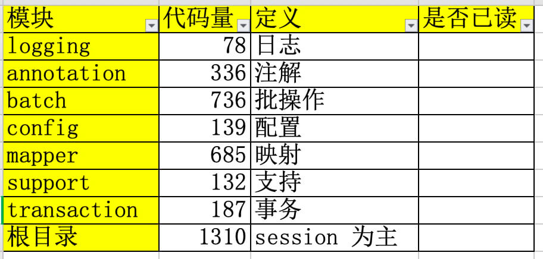

## 1. 依赖工具

* Maven
* Git
* JDK
* IntelliJ IDEA

## 2. 源码拉取

从官方仓库 https://github.com/mybatis/spring `Fork` 出属于自己的仓库。为什么要 `Fork` ？既然开始阅读、调试源码，我们可能会写一些注释，有了自己的仓库，可以进行自由的提交。

使用 `IntelliJ IDEA` 从 `Fork` 出来的仓库拉取代码。

本文使用的 MyBatis 版本为 `2.0.0-SNAPSHOT` 。统计代码量如下：



## 3. 调试

MyBatis 想要调试，非常方便，只需要打开 `org.mybatis.spring.sample.AbstractSampleTest` 单元测试类，选择 `#testFooService()` 方法，右键，开始调试即可。

```java
@DirtiesContext
public abstract class AbstractSampleTest {

    @Autowired
    protected FooService fooService;

    @Test
    final void testFooService() {
        User user = this.fooService.doSomeBusinessStuff("u1");
        assertThat(user).isNotNull();
        assertThat(user.getName()).isEqualTo("Pocoyo");
    }

}
```

有两点要注意：

1、因为单元测试基于 Junit5 ，所以需要依赖 JDK10 的环境，因此需要修改项目的 Project SDK 为 JDK10 。如下图所示：


2、AbstractSampleTest 是示例单元测试**基类**，它有五种实现类，分别如下：

```java
/**
 * 示例单元测试基类
 *
 * 1. {@link SampleEnableTest}
 *      基于 @MapperScan 注解，扫描指定包
 *
 * 2. {@link SampleMapperTest}
 *      基于 {@link org.mybatis.spring.mapper.MapperFactoryBean} 类，直接声明指定的 Mapper 接口
 *
 * 3. {@link SampleNamespaceTest}
 *      基于 <mybatis:scan /> 标签，扫描指定包
 *
 * 4. {@link SampleScannerTest}
 *      基于 {@link org.mybatis.spring.mapper.MapperScannerConfigurer} 类，扫描指定包
 *
 * 5. {@link SampleBatchTest}
 *      在 SampleMapperTest 的基础上，使用 BatchExecutor 执行器
 */
```

每种实现类，都对应其配置类或配置文件。胖友可以根据自己需要，运行 AbstractSampleTest 时，选择对应的实现类。
