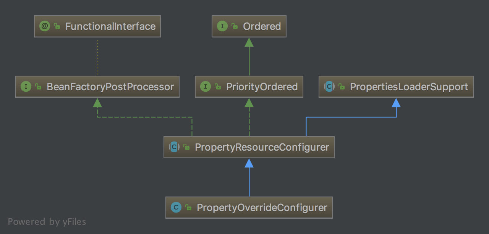

在文章 [《【死磕 Spring】—— IoC 之深入分析 BeanFactoryPostProcessor》](http://svip.iocoder.cn/Spring/IoC-BeanFactoryPostProcessor) 中提到，BeanFactoryPostProcessor 作用与 BeanDefinition 完成加载之后与 Bean 实例化之前，是 Spring 提供的一种强大的扩展机制。它有两个重要的子类，一个是 PropertyPlaceholderConfigurer，另一个是 PropertyOverrideConfigurer ，其中 PropertyPlaceholderConfigurer 允许我们通过配置 Properties 的方式来取代 Bean 中定义的占位符，而 **PropertyOverrideConfigurer** 呢？正是我们这篇博客介绍的。

> PropertyOverrideConfigurer 允许我们对 Spring 容器中配置的任何我们想处理的 bean 定义的 property 信息进行覆盖替换。

这个定义听起来有点儿玄乎，通俗点说，就是我们可以通过 PropertyOverrideConfigurer 来覆盖任何 bean 中的任何属性，只要我们想。

## 1. 使用

PropertyOverrideConfigurer 的使用规则是 `beanName.propertyName=value`，这里需要注意的是 `beanName.propertyName` 则是该 bean 中存在的属性。

### 1.1 示例一

依然使用以前的例子，`Student.class`，我们只需要修改下配置文件，声明下 PropertyOverrideConfigurer 以及其加载的配置文件。如下：

```xml
<bean class="org.springframework.beans.factory.config.PropertyOverrideConfigurer">
    <property name="locations">
        <list>
            <value>classpath:application.properties</value>
        </list>
    </property>
</bean>

<bean id="student" class="org.springframework.core.service.StudentService">
    <property name="name" value="chenssy"/>
</bean>
```

指定 student 的 `name` 属性值为 `"chenssy"` 。

声明 PropertyOverrideConfigurer 加载的文件为 `application.properties`，内容如下：

```
student.name = chenssy-PropertyOverrideConfigurer
```

指定 beanName 为 `student` 的 bean 的 `name` 属性值为 `"chenssy-PropertyOverrideConfigurer"` 。

测试打印 `student` 中的 `name` 属性值，代码如下：

```java
ApplicationContext context = new ClassPathXmlApplicationContext("spring.xml");

StudentService studentService = (StudentService) context.getBean("student");
System.out.println("student name:" + studentService.getName());
```

运行结果为：


从中可以看出 PropertyOverrideConfigurer 定义的文件取代了 bean 中默认的值。

### 1.2 示例二

下面我们看一个有趣的例子，如果我们一个 bean 中 PropertyPlaceholderConfigurer 和 PropertyOverrideConfigurer 都使用呢？那是显示谁定义的值呢？这里先简单分析下：如果PropertyOverrideConfigurer 先作用，那么 PropertyPlaceholderConfigurer 在匹配占位符的时候就找不到了，**如果 PropertyOverrideConfigurer 后作用，也会直接取代 PropertyPlaceholderConfigurer 定义的值，所以无论如何都会显示 PropertyOverrideConfigurer 定义的值**。是不是这样呢？看如下例子：

xml 配置文件调整如下：

```xml
<bean class="org.springframework.beans.factory.config.PropertyOverrideConfigurer">
    <property name="locations">
        <list>
            <value>classpath:application1.properties</value>
        </list>
    </property>
</bean>

<bean class="org.springframework.beans.factory.config.PropertyPlaceholderConfigurer">
    <property name="locations">
        <list>
            <value>classpath:application2.properties</value>
        </list>
    </property>
</bean>

<bean id="student" class="org.springframework.core.service.StudentService">
    <property name="name" value="${studentService.name}"/>
</bean>
```

指定 .PropertyOverrideConfigurer 加载文件为 `application1.properties` 。配置文件如下：

```
student.name = chenssy-PropertyOverrideConfigurer
```

PropertyPlaceholderConfigurer 加载文件为 `application2.properties` 。配置文件如下：

```
studentService.name = chenssy-PropertyPlaceholderConfigurer
```

`student` 的 `name` 属性使用占位符 `${studentService.name}`。

测试程序依然是打印 name 属性值，运行结果如下：


所以，上面的分析没有错。下面我们来分析 **PropertyOverrideConfigurer 实现原理**。

其实如果了解 PropertyPlaceholderConfigurer 的实现机制的话，那么 PropertyOverrideConfigurer 也不难猜测：加载指定 Properties，迭代其中的属性值，依据 `“.”` 来得到 `beanName`（`split(".")[0]`），从容器中获取指定的 BeanDefinition，然后得到 `name` 属性，进行替换即可。

## 2. 实现原理

UML 结构图如下：



与 PropertyPlaceholderConfigurer 一样，也是继承 PropertyResourceConfigurer，我们知道 PropertyResourceConfigurer 对 BeanFactoryPostProcessor 的 `#postProcessBeanFactory(ConfigurableListableBeanFactory beanFactory)` 方法提供了实现，在该实现中它会去读取指定配置文件中的内容，然后调用 `#processProperties(ConfigurableListableBeanFactory beanFactoryToProcess, Properties props)` 方法。该方法是一个抽象方法，具体的实现由子类来实现，所以这里我们只需要看 PropertyOverrideConfigurer 中 `#processProperties(ConfigurableListableBeanFactory beanFactoryToProcess, Properties props)` 方法的具体实现，代码如下：

```java
// PropertyOverrideConfigurer.java

@Override
protected void processProperties(ConfigurableListableBeanFactory beanFactory, Properties props)
        throws BeansException {
    // 迭代配置文件中的内容
    for (Enumeration<?> names = props.propertyNames(); names.hasMoreElements();) {
        String key = (String) names.nextElement();
        try {
            processKey(beanFactory, key, props.getProperty(key));
        } catch (BeansException ex) {
            String msg = "Could not process key '" + key + "' in PropertyOverrideConfigurer";
            if (!this.ignoreInvalidKeys) {
                throw new BeanInitializationException(msg, ex);
            }
            if (logger.isDebugEnabled()) {
                logger.debug(msg, ex);
            }
        }
    }
}
```

迭代 `props` 数组，依次调用 `#processKey(ConfigurableListableBeanFactory factory, String key, String value)` 方法，代码如下:

```java
// PropertyOverrideConfigurer.java

/**
 * The default bean name separator.
 */
public static final String DEFAULT_BEAN_NAME_SEPARATOR = ".";
/**
 * Bean 名字的分隔符
 */
private String beanNameSeparator = DEFAULT_BEAN_NAME_SEPARATOR;
/**
 * Contains names of beans that have overrides.
 */
private final Set<String> beanNames = Collections.newSetFromMap(new ConcurrentHashMap<>(16));
protected void processKey(ConfigurableListableBeanFactory factory, String key, String value)
        throws BeansException {
    // 判断是否存在 "."，即获取其索引位置
    int separatorIndex = key.indexOf(this.beanNameSeparator);
    if (separatorIndex == -1) {
        throw new BeanInitializationException("Invalid key '" + key +
                "': expected 'beanName" + this.beanNameSeparator + "property'");
    }
    // 得到 beanName
    String beanName = key.substring(0, separatorIndex);
    // 得到属性值
    String beanProperty = key.substring(separatorIndex+1);
    this.beanNames.add(beanName);
    // 替换
    applyPropertyValue(factory, beanName, beanProperty, value);
    if (logger.isDebugEnabled()) {
        logger.debug("Property '" + key + "' set to value [" + value + "]");
    }
}
```

获取分割符 `“.”` 的索引位置，得到 `beanName` 以及相应的属性，然后调用 `#applyPropertyValue(ConfigurableListableBeanFactory factory, String beanName, String property, String value)` 方法，代码如下：

```java
// PropertyOverrideConfigurer.java

protected void applyPropertyValue(ConfigurableListableBeanFactory factory, String beanName, String property, String value) {
    // 获得 BeanDefinition 对象
    BeanDefinition bd = factory.getBeanDefinition(beanName);
    BeanDefinition bdToUse = bd;
    while (bd != null) {
        bdToUse = bd;
        bd = bd.getOriginatingBeanDefinition();
    }
    // 设置 PropertyValue 到 BeanDefinition 中
    PropertyValue pv = new PropertyValue(property, value);
    pv.setOptional(this.ignoreInvalidKeys);
    bdToUse.getPropertyValues().addPropertyValue(pv);
}
```

从容器中获取 BeanDefinition ，然后根据属性 `property` 和其值 `value` 构造成一个 PropertyValue 对象，最后调用 `#addPropertyValue(PropertyValue pv )` 方法。PropertyValue 是用于保存一组bean属性的信息和值的对像。代码如下：

```java
// MutablePropertyValues.java

public MutablePropertyValues addPropertyValue(PropertyValue pv) {
    for (int i = 0; i < this.propertyValueList.size(); i++) {
        PropertyValue currentPv = this.propertyValueList.get(i);
        // 匹配
        if (currentPv.getName().equals(pv.getName())) {
            // 合并属性
            pv = mergeIfRequired(pv, currentPv);
            // 覆盖属性
            setPropertyValueAt(pv, i);
            return this;
        }
    }
    // 未匹配到，添加到 propertyValueList 中
    this.propertyValueList.add(pv);
    return this;
}
```

添加 PropertyValue 对象，替换或者合并相同的属性值。整个过程其实与上面猜测相差不是很大。

## 3. 小结

至此，PropertyOverrideConfigurer 到这里也就分析完毕了。最后看下 PropertyPlaceholderConfigurer 和 PropertyOverrideConfigurer 整体的结构图：


